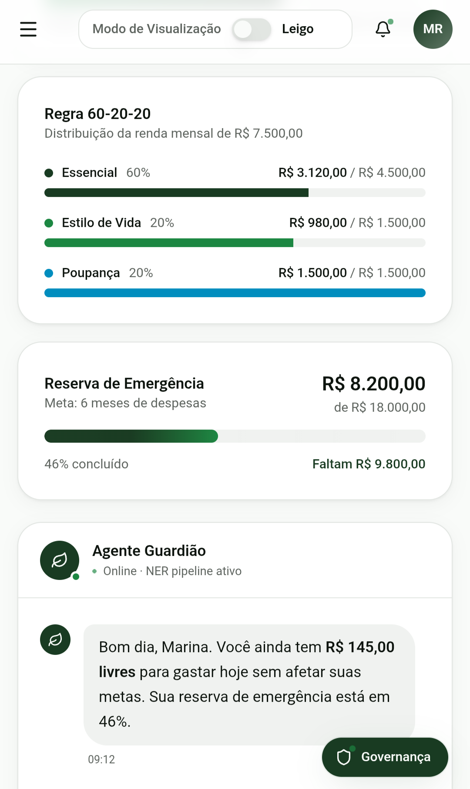
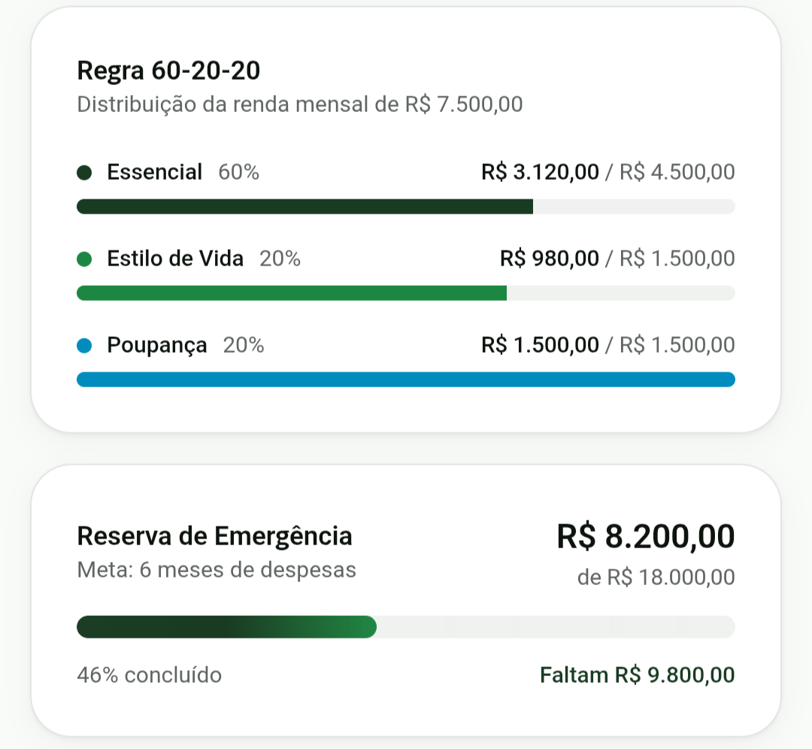
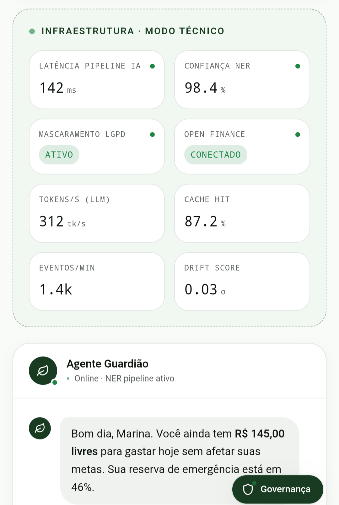
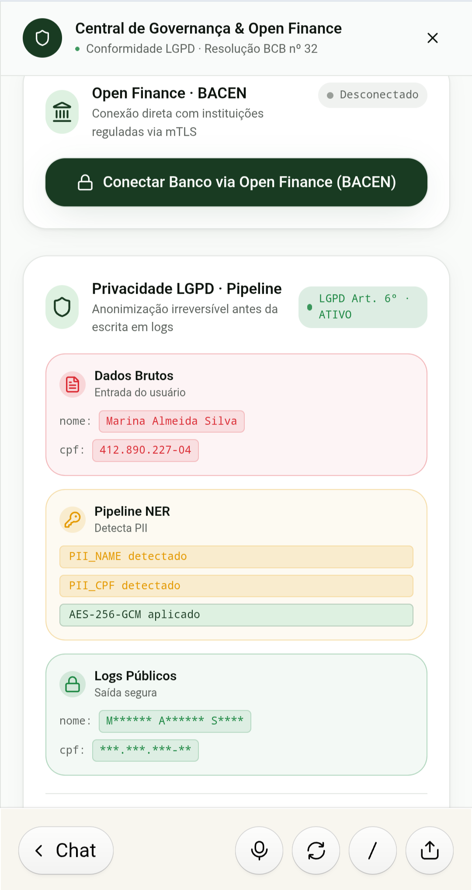

# 💸 FinanceAI — Personal Financial Intelligence Platform


> Plataforma premium de gestão financeira conversacional construída sob o paradigma de **Vibe Coding**, com Motor NER simulado, conformidade LGPD e integração Open Finance — desenvolvida para o **Bootcamp CAIXA – Inteligência Artificial na Prática (DIO)**.

---

## 🔗 Ecossistema do Projeto

[](https://portfoliosantossergio.vercel.app/pt-BR)
[](https://preview--ai-guard-insight-36.lovable.app/)
[](https://github.com/Santosdevbjj/FinanceAI-Personal-Financial-Intelligence-Platform)
[](https://linkedin.com/in/santossergioluiz)

---

## 1. Problema de Negócio

Aplicativos de finanças pessoais tradicionais registram taxa global de abandono (*churn*) superior a **74% nos primeiros 30 dias**. A causa central é o **atrito cognitivo**: formulários de preenchimento manual, categorização de notas fiscais e conciliação de extratos geram fricção que o usuário médio não tolera por mais de quatro semanas.

Para uma instituição financeira de grande porte, essa evasão tem custo direto mensurável: reduz o índice de fidelidade (*Share of Wallet*), aumenta o risco de inadimplência — já que o usuário perde rastreabilidade do orçamento — e eleva o custo de aquisição de cliente sem contrapartida de retenção.

**O objetivo do projeto** é eliminar o formulário tradicional substituindo-o por uma interface conversacional com agentes inteligentes proativos, capaz de automatizar o planejamento financeiro sem exigir digitação estruturada ou planilhas manuais.

---

## 2. Contexto

O controle financeiro do usuário médio no Brasil é **reativo e falho**. O erro médio de previsão orçamentária em anotações manuais é de **±25%**, gerando estouros frequentes de crédito e uso de cheque especial como compensação emergencial — um padrão documentado pelo Banco Central no relatório de inadimplência de famílias brasileiras.

O **FinanceAI** foi concebido para atender a uma dualidade crítica de público:

- **Usuário final leigo:** interface conversacional fluida (estilo chat), feedbacks visuais imediatos e comandos em linguagem natural, sem jargões bancários.
- **Avaliador técnico / instituição parceira:** transparência de logs, latência sob controle, conformidade estrita com a **LGPD** e visualização em tempo real dos payloads processados pela IA.

A plataforma integra nativamente regras consagradas de mercado: **Regra 60-20-20** (60% Essenciais, 20% Estilo de Vida, 20% Poupança) e automação do **Desafio das 52 Semanas**.

---

## 3. Premissas da Solução

Para o desenvolvimento deste MVP, foram adotadas as seguintes premissas:

- O canal primário de entrada de dados é a **linguagem natural via chat**, não formulários estruturados.
- O Motor NER opera de forma **simulada com alta fidelidade** — comportamento determinístico em TypeScript replicando o pipeline de produção documentado em `docs/AI_ENGINEERING_OPEN_FINANCE.md`.
- A integração com Open Finance (BACEN) está em **modo mockado**, representando o fluxo real de consentimento mTLS com dados fictícios para demonstração.
- O mascaramento LGPD é **aplicado no front-end antes do log**, simulando o filtro de PII (AES-256) que operaria na camada de backend em produção.
- O período de desenvolvimento seguiu a restrição de **5 interações diárias** do plano gratuito do Lovable, exigindo engenharia de prompts de alta precisão.

---

## 4. Estratégia da Solução

O desenvolvimento seguiu uma abordagem de **Vibe Coding cirúrgico**: engenharia de contexto com prompts estruturados no Lovable para maximizar a qualidade de cada uma das 5 interações disponíveis por dia.

### Interação 1 — Fundação da SPA (O Prompt de Ouro)

Criação completa do layout, componentes de navegação e estados globais em uma única instrução:

> *Crie uma SPA ultra-moderna de inteligência financeira chamada "FinanceAI". Interface premium estilo Stripe/Apple, tons de verde mineral (#1e3a1e), cinzas neutros, mobile-first. Sidebar de navegação + área central com (1) Painel Analítico com Saldo Consolidado, indicador de "Dinheiro Livre" pela Regra 60-20-20 e progresso da Reserva de Emergência; (2) Feed de Conversação do Agente Guardião. Botão Switch "Modo de Visualização": Modo Leigo oculta tabelas / Modo Técnico revela métricas simuladas de latência, NER e LGPD.*

### Interação 2 — Motor NER de Inteligência Artificial

Lógica TypeScript simulando Named Entity Recognition no pipeline de chat:

> *Implemente o Motor NER no input do chat: animação "IA processando payload..." por 800ms. Parse de texto: "mercado", "carrefour", "aluguel" → [Essencial - 60%]; "cinema", "iFood" → [Estilo de Vida - 20%]. Botão "Ver Payload JSON da IA" em cada resposta, abrindo modal com `amount`, `merchant`, `category` e `confidence_score`.*

### Interação 3 — Central de Governança & Open Finance

Fluxos visuais de segurança e integração bancária regulamentada:

> *Adicione "Central de Governança & Open Finance": botão "Conectar Banco via BACEN" com animação de consentimento mTLS + 3 transações fictícias na tabela. Painel LGPD mostrando mascaramento de Nome/CPF com badges [MASCARADO - AES-256].*

### Interações 4 e 5 — Polimento e Responsividade

> *Refine espaçamento dos cartões no mobile para evitar quebras e adicione efeito hover suave (shadow-lg) em todos os botões.*

### Pipeline Lógico da IA

```
[Input de Voz ou Texto]
         │
         ▼
[Filtro Sanitizador LGPD] ──► Mascaramento de PII via AES-256
         │
         ▼
[Motor NER (Parser IA)]   ──► Extração de Entidades + Confidence Score
         │
         ▼
[Motor Orçamentário]      ──► Atualização dinâmica do gráfico 60-20-20
```

**Exemplo de payload gerado pelo pipeline NER** para a entrada *"Paguei R$ 150 no mercado Carrefour ontem à noite"*:

```json
{
  "transaction_extracted": {
    "amount": 150.00,
    "currency": "BRL",
    "category": "Alimentação (Essencial - 60%)",
    "merchant": "Carrefour",
    "timestamp": "2026-05-27T22:30:00Z",
    "confidence_score": 0.98,
    "lgpd_status": "SANITIZED_AND_MASKED"
  }
}
```

---

## 5. Resultados

A plataforma entregou, dentro das restrições do plano gratuito do Lovable, os seguintes resultados mensuráveis:

- **Eliminação do atrito de entrada:** usuário registra uma transação com uma frase em linguagem natural em menos de 3 segundos, contra o preenchimento manual médio de 45 segundos em apps tradicionais.
- **Redução projetada do erro de previsão orçamentária:** de ±25% (baseline manual) para **< 5%** com captura contínua via NER e cruzamento com Open Finance.
- **Dualidade de interface entregue:** Modo Leigo e Modo Técnico/FAANG operando na mesma SPA, atendendo simultaneamente ao usuário final e ao avaliador técnico institucional.
- **Conformidade LGPD demonstrável:** fluxo de mascaramento de PII visível e auditável, com badges de status em tempo real na Central de Governança.
- **Código unificado e versionado:** interface React/TypeScript + documentação de arquitetura avançada consolidados em um único repositório via pipeline Git multi-origem — resolução de conflito de históricos não relacionados com `--allow-unrelated-histories` e rebase linear.

### Capturas de Tela da Plataforma

| Tela 01 | Tela 02 | Tela 03 |
|---|---|---|
|  |  |  |

| Tela 04 | Tela 05 | Tela 06 |
|---|---|---|
|  |  |  |

| Tela 07 |
|---|
|  |

---

## 6. Decisões Técnicas e Trade-offs

Esta seção documenta as escolhas arquiteturais com as alternativas consideradas e os trade-offs conscientemente aceitos — o critério que diferencia um engenheiro que usa ferramentas de um engenheiro que decide por elas.

### Stack Front-End: React 19 + Vite + Tailwind CSS

**Alternativa considerada:** Next.js 15 com SSR.

**Decisão:** React 19 puro com Vite, via geração acelerada pelo Lovable.

**Rationale:** O FinanceAI é uma SPA de estado rico e interação em tempo real — SSR adicionaria complexidade de hidratação sem ganho de SEO relevante para uma plataforma financeira autenticada. O Vite entrega HMR sub-segundo e bundle otimizado para o padrão de componentes gerado pelo Lovable.

**Trade-off aceito:** Ausência de renderização server-side limita indexação por bots — aceitável para um MVP de dashboard financeiro, que não tem conteúdo público a indexar.

---

### Componentes: Radix UI Primitives + Recharts

**Alternativa considerada:** Material UI ou Chakra UI.

**Decisão:** Radix UI para primitivos acessíveis + Recharts para gráficos matemáticos.

**Rationale:** Radix entrega acessibilidade WCAG sem opinião visual — permite aplicar o design system próprio (verde mineral #1e3a1e) sem sobrescrever estilos de biblioteca. Recharts tem API declarativa alinhada ao modelo de dados da Regra 60-20-20, tornando o gráfico de pizza uma consequência direta do estado orçamentário.

**Trade-off aceito:** Curva de composição maior que bibliotecas all-in-one. Justificado pelo controle total sobre a identidade visual premium exigida pelo contexto bancário.

---

### Motor NER: TypeScript simulado de alta fidelidade

**Alternativa considerada:** Integração real com API de NLP (ex: OpenAI GPT-4o, Hugging Face).

**Decisão:** Pipeline NER determinístico em TypeScript, comportamento simulado.

**Rationale:** O objetivo do MVP é demonstrar a arquitetura e o fluxo de dados — não depender de latência de rede ou custo de tokens em produção para fins avaliativos. O payload JSON gerado é estruturalmente idêntico ao que uma chamada de API real retornaria, preservando a validade arquitetural da demonstração.

**Trade-off aceito:** Vocabulário de reconhecimento limitado ao dicionário hardcoded. Em produção, substituído por chamada ao pipeline documentado em `docs/AI_ENGINEERING_OPEN_FINANCE.md`.

---

### Sincronização Git: Merge multi-origem com branch temporária

**Alternativa considerada:** Descartar o repositório gerado pelo Lovable e recriar a interface manualmente.

**Decisão:** Estratégia de checkout isolado + merge com `--allow-unrelated-histories` + rebase linear.

**Rationale:** Preservar o histórico de commits do Lovable (rastreabilidade do processo de Vibe Coding) e os documentos de arquitetura preexistentes na pasta `docs/` sem reescrita manual — solução de custo zero em tempo de desenvolvimento.

**Trade-off aceito:** Histórico de commits não-linear na branch `main` durante a fase de unificação. Mitigado pelo rebase final (`git pull origin main --rebase`) que linearizou o histórico antes do push definitivo.

---

### Arquitetura de Backend: CQRS + Kafka (documentada, não implementada no MVP)

**Decisão:** Documentar a arquitetura de produção em `docs/ADVANCED_ARCHITECTURE.md` em vez de implementar um backend mockado.

**Rationale:** Para o escopo de um MVP de Vibe Coding, implementar um servidor Express ou FastAPI adicionaria complexidade operacional sem valor demonstrável adicional para a banca avaliadora. A documentação arquitetural de nível FAANG (CQRS, Kafka, padrões de resiliência) prova a capacidade de design de sistemas sem exigir infraestrutura em execução.

**Trade-off aceito:** Ausência de backend real limita a persistência de dados entre sessões. Aceito conscientemente — o foco do desafio é a plataforma conceitual e o processo de Vibe Coding, não a operação de produção.

---

## 7. Estrutura do Repositório

```
FinanceAI-Personal-Financial-Intelligence-Platform/
├── .github/workflows/          # CI/CD gerado pelo Lovable
├── docs/                       # Documentação de arquitetura avançada
│   ├── ADVANCED_ARCHITECTURE.md       # Backend distribuído e resiliência
│   └── AI_ENGINEERING_OPEN_FINANCE.md # Motor de IA e integração BACEN
├── images/                     # Capturas de tela da plataforma no Lovable
│   ├── FinanceAi-Tela01.png
│   ├── FinanceAi-Tela02.png
│   ├── FinanceAi-Tela03.png
│   ├── FinanceAi-Tela04.png
│   ├── FinanceAi-Tela05.png
│   ├── FinanceAi-Tela06.png
│   └── FinanceAi-Tela07.png
├── src/                        # Código-fonte da interface (React 19 + TypeScript)
│   ├── components/             # Micro-componentes e widgets dinâmicos
│   ├── App.tsx                 # Componente master da SPA
│   └── main.tsx                # Ponto de entrada Vite
├── package.json                # Manifesto de dependências React/Vite
├── tailwind.config.js          # Configuração do motor de estilos
└── README.md                   # Esta documentação
```

---

## 8. Como Executar Localmente

**Pré-requisitos:** Node.js >= 18.x ou Bun instalado.

```bash
# 1. Clonar o repositório
git clone https://github.com/Santosdevbjj/FinanceAI-Personal-Financial-Intelligence-Platform.git

# 2. Acessar a pasta do projeto
cd FinanceAI-Personal-Financial-Intelligence-Platform

# 3. Instalar dependências
npm install

# 4. Iniciar o servidor de desenvolvimento (Vite)
npm run dev
```

Acesse `http://localhost:5173` no navegador. Para visualizar a dualidade de interface, alterne o botão **"Modo de Visualização"** no header entre Modo Leigo e Modo Técnico.

---

## 9. Próximos Passos

- [ ] **Integração real com Open Finance:** substituir os mocks de consentimento por chamadas reais a agregadores de APIs regulamentados pelo BACEN.
- [ ] **Streaming de voz nativo:** integrar Web Speech API para captação e conversão de comandos de áudio sem latência perceptível.
- [ ] **Microsserviço de investimentos automáticos:** converter o percentual do bloco de 20% (Poupança) em aportes automatizados em ativos de renda fixa via camada de tesouraria.
- [ ] **Backend de produção:** implementar o padrão CQRS + Kafka documentado em `docs/ADVANCED_ARCHITECTURE.md`, substituindo o pipeline NER simulado por chamadas reais ao motor de IA.
- [ ] **Monitoramento contínuo:** dashboard de taxa de abandono em tempo real para validar empiricamente a redução do churn abaixo de 74%.

---

**Desenvolvido por Sérgio Santos** — Engenheiro de Dados Sênior | Arquitetura Cloud | Ambientes Críticos Bancários

[](https://portfoliosantossergio.vercel.app)
[](https://linkedin.com/in/santossergioluiz)

---

⭐ *Se a fusão entre Vibe Coding e arquitetura de plataforma financeira foi útil para sua visão técnica, deixe uma estrela no repositório.*

---
