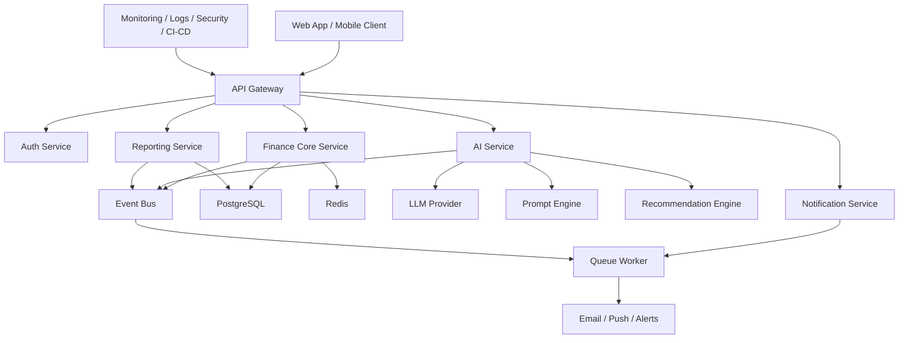
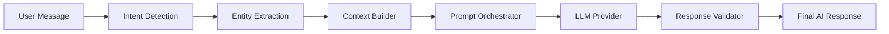
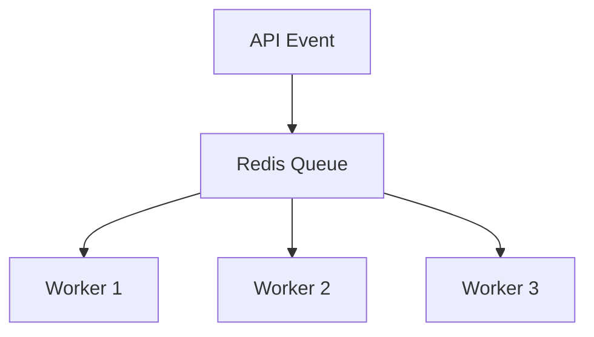
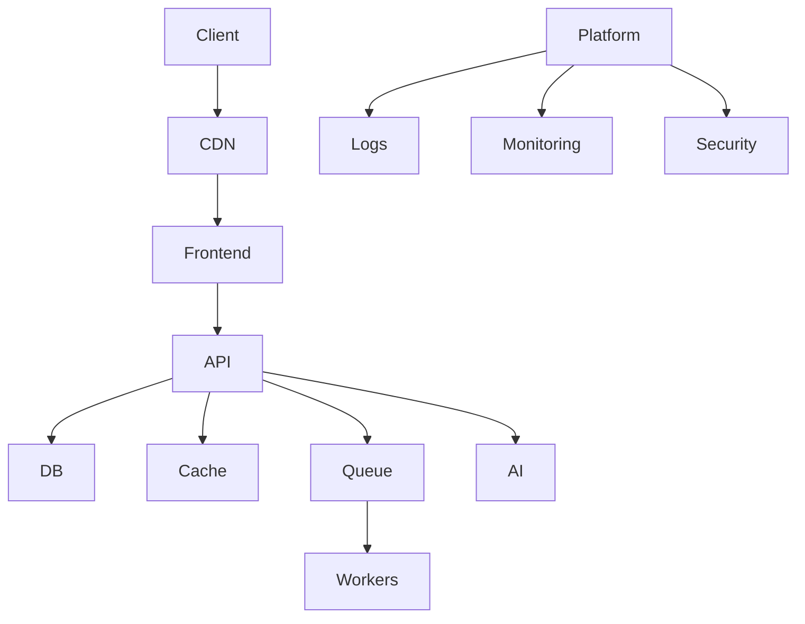

# ARCHITECTURE — FinanceAI Personal Financial Intelligence Platform

Version: 1.0  
Status: Production Architecture Specification  
Owner: Platform Engineering / AI Engineering  
Repository: FinanceAI-Personal-Financial-Intelligence-Platform

---

# 1. Overview

FinanceAI is an AI-native personal financial intelligence platform designed with a **cloud-native, scalable, secure, event-driven architecture**.

The system is built around five major domains:

1. **Client Experience Layer**
2. **API & Business Logic Layer**
3. **AI Intelligence Layer**
4. **Data Layer**
5. **Infrastructure & Platform Layer**

Core architectural principles:

- AI-first architecture
- Modular domain-driven design
- Event-driven workflows
- Cloud-native scalability
- Security by default
- Observability-first
- Production-grade resilience

---

# 2. High-Level System Architecture



---

# 3. Architecture Style

FinanceAI adopts a **modular monolith with service boundaries**, designed to evolve into microservices when scale demands.

## Why Modular Monolith First

Benefits:

- Faster MVP delivery
- Lower operational complexity
- Easier debugging
- Shared transaction boundaries
- Better early-stage developer velocity

## Evolution Path

Future extraction candidates:

- AI Service
- Notification Service
- Reporting Engine
- Open Finance Connector

---

# 4. Architectural Principles

---

## 4.1 Domain-Driven Design (DDD)

Core domains:

- Identity
- Transactions
- Goals
- Insights
- AI Coaching
- Reporting
- Notifications

---

## 4.2 Event-Driven Processing

Async processes use domain events.

Examples:

- TransactionCreated
- GoalProgressUpdated
- InsightGenerated
- UserRiskDetected

---

## 4.3 AI-Native Architecture

AI is a first-class system component, not an external feature.

---

## 4.4 Security by Design

Security controls embedded in every layer.

---

# 5. Frontend Architecture

---

## Stack

- Next.js 15
- React 19
- TypeScript
- TailwindCSS
- shadcn/ui
- Zustand
- React Query
- Zod
- Recharts

---

## Frontend Layers

```text
src/

app/
components/
features/
hooks/
services/
store/
lib/
types/
utils/
```

---

## App Router Structure

```text
app/

(auth)
(dashboard)
(api)
settings
goals
transactions
reports
chat
```

---

## Frontend Architecture Pattern

Feature-based modular architecture:

```text
features/

auth/
transactions/
goals/
dashboard/
chat/
reports/
insights/
```

Each feature contains:

- components
- hooks
- services
- types
- validation
- tests

---

## State Management

### Server State

Managed by:

- React Query

Responsibilities:

- API cache
- optimistic updates
- background refresh

---

### Client State

Managed by:

- Zustand

Responsibilities:

- UI state
- chat draft
- modal state
- preferences

---

## Form Management

- React Hook Form
- Zod schema validation

---

# 6. Backend Architecture

---

## Stack

- NestJS
- TypeScript
- Prisma
- PostgreSQL
- Redis
- BullMQ

---

## Backend Layers

```text
src/

modules/
common/
config/
database/
queues/
events/
ai/
infra/
```

---

## Module Structure

Example:

```text
transactions/

controller/
service/
repository/
dto/
entities/
events/
tests/
```

---

## Layer Responsibilities

---

### Controller Layer

Responsibilities:

- HTTP input
- validation
- auth guards
- response serialization

---

### Service Layer

Responsibilities:

- business logic
- orchestration
- transactions
- policies

---

### Repository Layer

Responsibilities:

- persistence abstraction

---

### Event Layer

Responsibilities:

- async domain event publishing

---

# 7. Domain Modules

---

## Identity Module

Responsibilities:

- signup
- login
- JWT
- refresh token
- RBAC
- sessions

---

## Transactions Module

Responsibilities:

- create transaction
- edit
- categorize
- recurring expenses
- filters
- tagging

---

## Goals Module

Responsibilities:

- create goal
- track progress
- milestone logic

---

## Insights Module

Responsibilities:

- spending analytics
- anomaly detection
- savings opportunities

---

## AI Module

Responsibilities:

- prompt orchestration
- chat context
- recommendation generation
- intent extraction

---

## Reporting Module

Responsibilities:

- dashboards
- summaries
- exports

---

## Notification Module

Responsibilities:

- email
- alerts
- reminders
- push notifications

---

# 8. API Architecture

---

## API Style

Hybrid:

- REST (primary)
- GraphQL (future optional)

---

## REST Standards

Pattern:

```text
/api/v1/resource
```

Examples:

```text
POST /api/v1/auth/login
POST /api/v1/transactions
GET /api/v1/reports/monthly
POST /api/v1/chat/message
```

---

## API Design Rules

Mandatory:

- versioning
- pagination
- filtering
- sorting
- idempotency where applicable
- structured errors

---

## Response Format

Success:

```json
{
  "success": true,
  "data": {},
  "meta": {}
}
```

Error:

```json
{
  "success": false,
  "error": {
    "code": "VALIDATION_ERROR",
    "message": "Invalid input"
  }
}
```

---

# 9. AI Architecture

---

## AI Service Overview

FinanceAI uses a dedicated AI orchestration layer.

---

## Components

### Prompt Orchestrator

Responsibilities:

- prompt templates
- context injection
- token control
- response validation

---

### Intent Engine

Detects:

- expense logging
- financial advice request
- goal creation
- report query

---

### Entity Extraction Engine

Extracts:

- amount
- merchant
- date
- category
- recurrence

---

### Recommendation Engine

Generates:

- savings recommendations
- spending alerts
- financial coaching insights

---

### Guardrail Layer

Prevents:

- hallucinations
- invalid financial guidance
- prompt injection abuse

---

## AI Flow



---

## AI Provider Strategy

Abstraction layer for:

- OpenAI
- Anthropic (future)
- local model support (future)

---

# 10. Data Architecture

---

## Primary Database

PostgreSQL

Used for:

- transactional data
- user data
- financial records
- goals
- AI metadata

---

## Cache Layer

Redis

Used for:

- sessions
- rate limiting
- prompt cache
- hot dashboards

---

## Queue Storage

Redis / BullMQ

Used for:

- async jobs
- reports
- alerts
- AI batch jobs

---

# 11. High-Level Data Model

---

## Users

```text
id
email
password_hash
preferences
financial_profile
created_at
```

---

## Transactions

```text
id
user_id
amount
currency
category
description
transaction_date
merchant
source
created_at
```

---

## Goals

```text
id
user_id
target_amount
deadline
progress
status
```

---

## Insights

```text
id
user_id
type
message
severity
generated_at
```

---

## AI Conversations

```text
id
user_id
messages
context
model
created_at
```

---

# 12. Event-Driven Architecture

---

## Event Bus

Internal domain events.

Examples:

```text
TransactionCreated
GoalCreated
GoalMilestoneReached
MonthlyReportGenerated
RiskAlertDetected
InsightGenerated
```

---

## Async Consumers

Workers process:

- report generation
- email sending
- AI background insights
- alerts

---

## Queue Architecture



---

# 13. Authentication & Security Architecture

---

## Authentication

- Email/password
- OAuth
- JWT access tokens
- Refresh tokens

---

## Authorization

RBAC-based permissions

Roles:

- user
- admin
- support

---

## Security Controls

Mandatory:

- HTTPS only
- CSP
- CSRF protection
- XSS protection
- SQL injection protection
- rate limiting
- secret rotation
- audit logging

---

## Sensitive Data Protection

- encryption at rest
- encrypted backups
- secure secret manager

---

## Compliance

Target:

- LGPD
- GDPR-ready

---

# 14. AI Security

---

## Guardrails

Mandatory:

- prompt sanitization
- injection detection
- unsafe output filtering
- hallucination mitigation

---

## AI Decision Constraints

AI cannot:

- provide regulated financial advice
- execute transactions
- override business rules

---

# 15. Observability Architecture

---

## Monitoring

Tools:

- OpenTelemetry
- Grafana
- Prometheus

---

## Logging

Structured JSON logs

Fields:

- trace_id
- user_id
- request_id
- latency
- service

---

## Error Tracking

Recommended:

- Sentry

---

## Metrics

Track:

- API latency
- AI latency
- queue health
- DB performance
- cache hit rate
- user engagement

---

# 16. Performance Architecture

---

## Caching Strategy

Use cache for:

- dashboards
- reports
- AI prompt templates
- analytics

---

## Database Optimization

Strategies:

- indexes
- query optimization
- pagination
- connection pooling

---

## Async Processing

Heavy workloads moved off request cycle.

---

# 17. Scalability Strategy

---

## Horizontal Scaling

Stateless API nodes.

---

## Read Scalability

Future:

- read replicas

---

## AI Scalability

Future:

- AI request queues
- token budgeting
- provider failover

---

# 18. Infrastructure Architecture

---

## Deployment Model

Cloud-native containerized deployment.

---

## Recommended Infra

- Vercel (frontend)
- AWS ECS / EKS (backend)
- RDS PostgreSQL
- ElastiCache Redis
- S3 backups
- CloudWatch

---

## Infra Diagram



---

# 19. CI/CD Architecture

---

## Pipeline

```text
Push
→ Lint
→ Unit Tests
→ Integration Tests
→ Build
→ Security Scan
→ Docker Build
→ Deploy Staging
→ E2E Tests
→ Deploy Production
```

---

## GitHub Actions Responsibilities

- tests
- lint
- coverage
- build
- secrets validation
- dependency audit

---

# 20. Testing Strategy

---

## Unit Tests

Coverage target:

> 80%+

---

## Integration Tests

Validate:

- DB
- API
- services

---

## E2E Tests

Validate:

- signup
- transaction flow
- goal flow
- AI chat flow

---

## Load Testing

Required before scale.

---

# 21. Repository Engineering Structure

```text
FinanceAI-Personal-Financial-Intelligence-Platform/

apps/
  web/
  api/

packages/
  ui/
  config/
  types/
  utils/
  ai/

infra/
  docker/
  terraform/

docs/
  PRD.md
  ARCHITECTURE.md
  API.md
  SECURITY.md

.github/
```

---

# 22. Deployment Environments

---

## Development

Local environment

---

## Staging

Pre-production validation

---

## Production

Hardened production environment

---

# 23. Disaster Recovery

---

## Backups

- daily DB backups
- encrypted storage

---

## Recovery Targets

RPO: < 15 min  
RTO: < 1 hour

---

# 24. Engineering Tradeoffs

---

## Monolith vs Microservices

Decision:

Start modular monolith.

Reason:

- speed
- simplicity
- cost efficiency

---

## REST vs GraphQL

Decision:

REST first.

Reason:

- simplicity
- caching
- lower complexity

---

## AI Provider Lock-in

Decision:

Provider abstraction layer.

---

# 25. Production Readiness Checklist

Mandatory before GA:

- Security audit
- Load test
- AI guardrails validation
- DB migration validation
- Backup restore test
- Observability validation
- Secrets audit
- Cost monitoring
- Runbooks documented

---

# 26. Final Architecture Statement

FinanceAI architecture is designed to deliver:

- Simplicity for MVP
- Scalability for growth
- Security for trust
- Intelligence for differentiation
- Reliability for production

It is an AI-native financial platform engineered for real-world scale.
